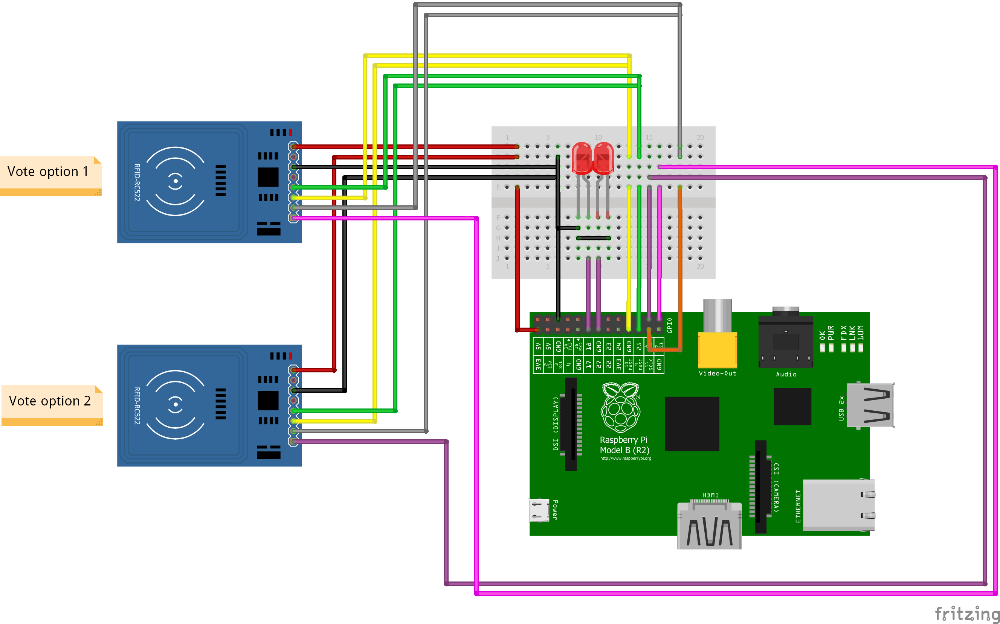

Raspberry Pi voting machine (PoC)
=================================

Part list
---------

 * Raspberry Pi model B
 * 2 x MF522 RFID readers

Schematic
---------

Pins
----

| RC522    | RPi             |
|----------|-----------------|
| SDA (1)  | CE0/CE1 (24/26) |
| SCK (2)  | SCLK (23)       |
| MOSI (3) | MOSI (19)       |
| MISO (4) | MISO  (21)      |
| IRQ (5)  | ----            |
| GND (6)  | GND (any)       |
| RST (7)  | ----            |
| 3.3V (8) | 3V3 (any)       |

